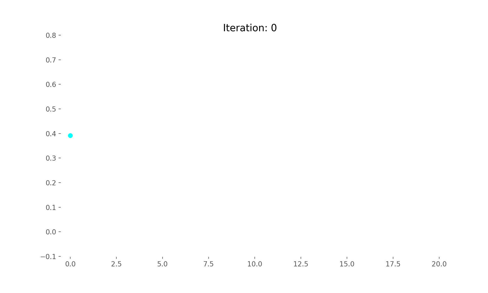
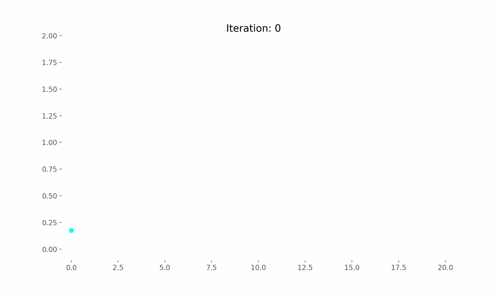

# DataDrivenControl-AI-RL-NZSG-Tracking

## Introduction
Here is my implementation of the model described in the paper **Optimal tracking control for non-zero-sum games of linear
discrete-time systems via off-policy reinforcement learning** [paper](https://onlinelibrary.wiley.com/doi/abs/10.1002/oca.2597).

## Experiments:
The corresponding feedback Nash equilibrium
```math
K_1^* =    \begin{bmatrix}
-0.1616 & -0.1618 & -0.0555 & 0.1638
    \end{bmatrix}
;
K_2^* =    \begin{bmatrix}
-0.0855 & -0.0859 & 0.0073& 0.0896
    \end{bmatrix}

```

Using the Off-Policy algorithm, I found the following control matrices
```math
K_1^{\infty} =    \begin{bmatrix}
-0.161585	& -0.161827 &	-0.0555294 &	0.163771

    \end{bmatrix}
;
K_2^{\infty} =    \begin{bmatrix}
-0.0854708 &	-0.0858552 &	0.00733787 &	0.0896064

    \end{bmatrix}

```

## Comment
The probing noise will not affect the
system and the Nash equilibrium solution learned without
deviation with Off-Policy Algorithm.


## Results

### Results Off-Policy Algorithm

| Convergence of the optimal control matrix (Off-Policy) | Convergence of the optimal control matrix (Off-Policy) |
| ------------- | ------------- |
|  |  |


## How to use my code

With my code, you can:

* **Model-Based** by running `ModelBased.m`
* **Off-Policy Algorithm** by running `SolutionOffpolicyTracking.py`

## Docker
I will provide DockerFile soon.

## Requirements

* **Matlab**
* **python 3.11**
* **numpy**
* **matplotlib**
